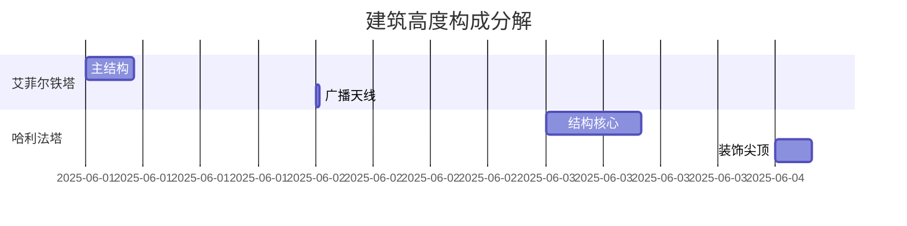
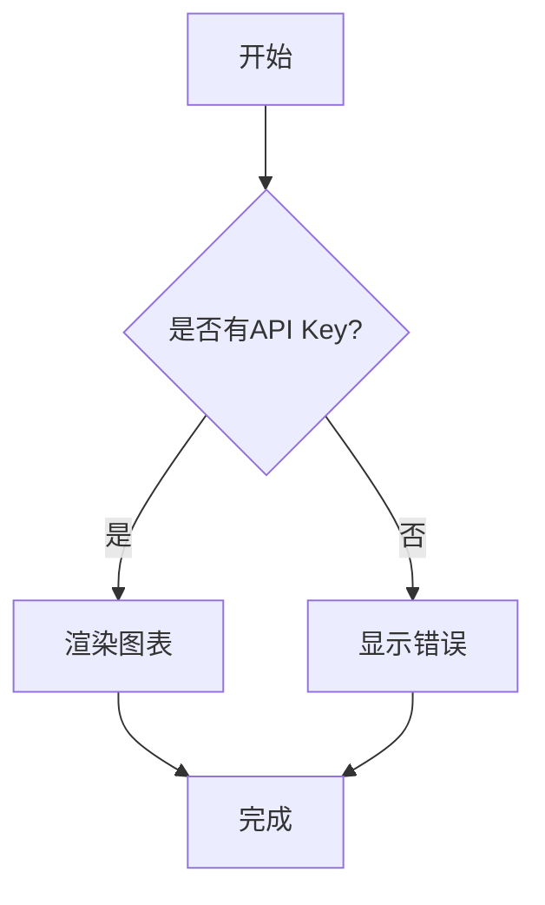
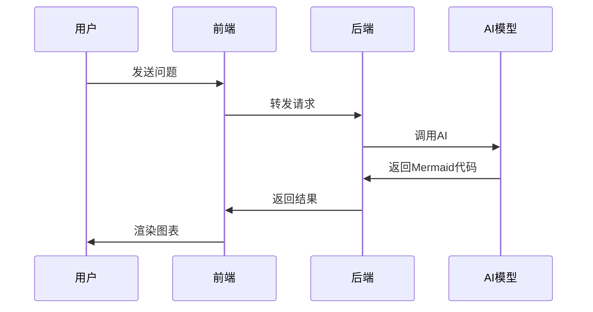

# Mermaid 图表测试

## 甘特图测试

```mermaid
gantt
    title 建筑高度构成分解
    axisFormat %Y-%m-%d
    section 艾菲尔铁塔
    主结构      :2025-06-01, 300m
    广播天线    :2025-06-02, 24m
    section 哈利法塔  
    结构核心    :2025-06-03, 601m
    装饰尖顶    :2025-06-04, 227m
```

## 流程图测试

```mermaid
flowchart TD
    A[开始] --> B{是否有API Key?}
    B -->|是| C[渲染图表]
    B -->|否| D[显示错误]
    C --> E[完成]
    D --> E
```

## 时序图测试

```mermaid
sequenceDiagram
    participant U as 用户
    participant F as 前端
    participant B as 后端
    participant LLM as AI模型
    
    U->>F: 发送问题
    F->>B: 转发请求
    B->>LLM: 调用AI
    LLM->>B: 返回Mermaid代码
    B->>F: 返回结果
    F->>U: 渲染图表
``` 